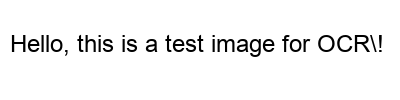

# test_image



## AI Description

**Visual Content:** a black and white photo with the words hello, hello and hello

## Extracted Text (OCR)

```
Hello, this is a test image for OCR\!
```

## Technical Information

- **File:** test_image.png
- **Format:** PNG
- **Size:** 4779 bytes
- **OCR Engine:** Tesseract
- **AI Vision:** BLIP Model
